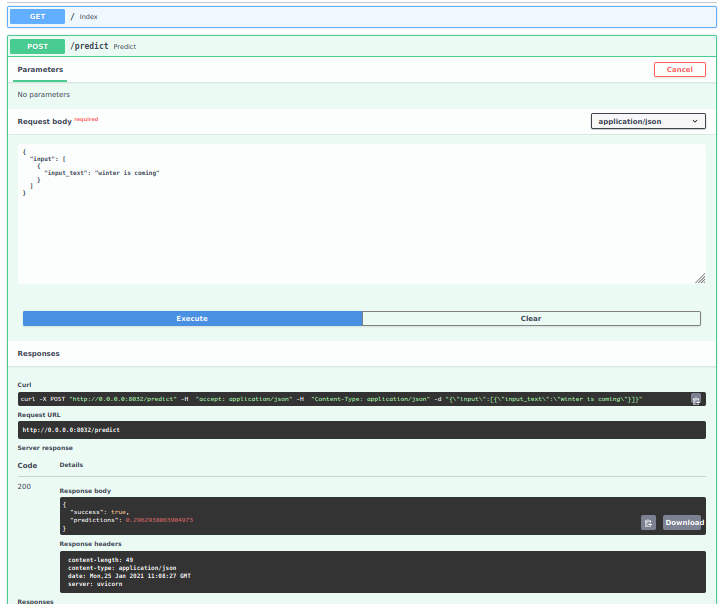
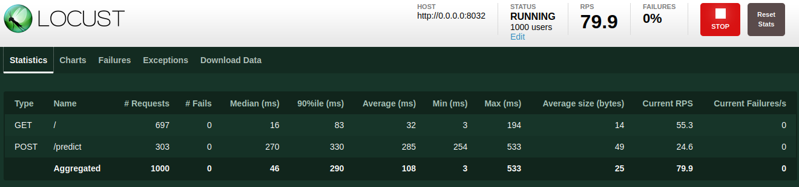
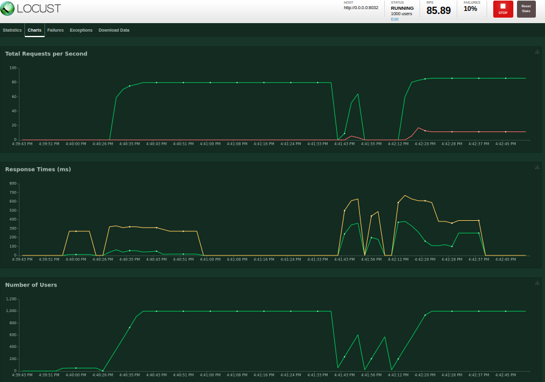

# Create Scalable Async API using REDIS


- This repo contains a simplified version of this  [blog](https://medium.com/analytics-vidhya/deploy-machine-learning-models-with-keras-fastapi-redis-and-docker-4940df614ece) post and [code repo](https://github.com/shanesoh/deploy-ml-fastapi-redis-docker) 

## Architecture


This repo has three main file:

- `model_server.py` - contains the dummy classifier
  - In actual application replace the dummy model with the original one.
- `web_server.py` - contains the `/predict` api using FastAPI
- `locustfile.py` - script for load testing

----

## :star: Package dependencies:

- `redis`
- `locust`
- `fastapi`
- `uvicorn`
- ...

## :star: How to setup Redis:


- Follow [this](https://www.pyimagesearch.com/2018/01/29/scalable-keras-deep-learning-rest-api/) article

**Installation:**

```py
$ wget http://download.redis.io/redis-stable.tar.gz
$ tar xvzf redis-stable.tar.gz
$ cd redis-stable
$ make
$ sudo make install
```

**To start the Redis server, use the following command:**

```py
$ cd redis-stable
$ src/redis-server
```

## :star: Start model_server.py

```py
python model_server.py
```

## :star: Start web_server.py

```py
uvicorn web_server:app --reload --port 8032 --host 0.0.0.0
```

<center>

</center>

----

## :star: Load testing

```py
locust -f locustfile.py
```


<center>

</center>


<center>

</center>

**Reference:**

- [Serve a machine learning model using Sklearn, FastAPI and Docker](https://medium.com/analytics-vidhya/serve-a-machine-learning-model-using-sklearn-fastapi-and-docker-85aabf96729b)
- [Deploy Machine Learning Models with Keras, FastAPI, Redis and Docker](https://medium.com/analytics-vidhya/deploy-machine-learning-models-with-keras-fastapi-redis-and-docker-4940df614ece)
- [A scalable Keras + deep learning REST API](https://www.pyimagesearch.com/2018/01/29/scalable-keras-deep-learning-rest-api/)

----


# :dart: Multiple model syndrome

Quoting from [this](https://www.pyimagesearch.com/2018/01/29/scalable-keras-deep-learning-rest-api/) blog:

Depending on how you deploy your REST API, there is a subtle problem with keeping the `classify_process()` function in the same file as the rest of our web API code i.e `/predict`.

Most web servers, including Apache and nginx, allow for multiple client threads.

If you keep `classify_process()` in the same file as your `/predict`
view, then you may load multiple models if your server software deems it necessary to create a new thread to serve the incoming client requests — for every new thread, a new view will be created, and therefore a new model will be loaded.

The solution is to move `classify_process()`
to an entirely separate process and then start it along with your `FastAPI` web server and `Redis` server.


- This repository implements the above strategy.

----

## ToDO:

- [ ] implement `docker` version
- [x] Set up `locust` for load testing

----

 


