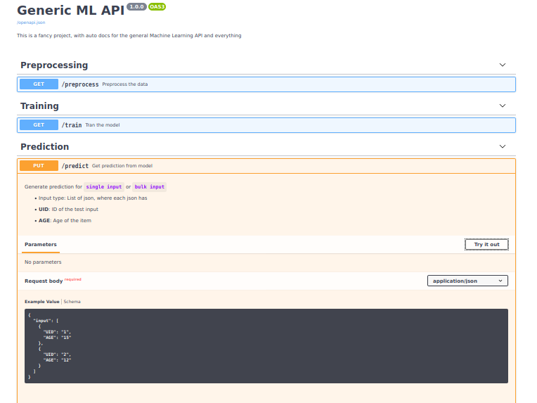

# Instructions 

## Start the `/predicct` server

- `cd swagger_api`
- `uvicorn ml_api:app --reload --port 8032 --host 0.0.0.0`

Then check the swagger ui at: 
- link 1: [http://0.0.0.0:8032/docs](http://0.0.0.0:8032/docs)
- link 2: [http://0.0.0.0:8032/redoc](http://0.0.0.0:8032/redoc)

# FastAPI Important Documentation

- [Request body](https://fastapi.tiangolo.com/tutorial/body/)
- [Add project description](https://fastapi.tiangolo.com/tutorial/metadata/)
- [Add API Description](https://fastapi.tiangolo.com/tutorial/path-operation-configuration/)
- [Add API example value](https://fastapi.tiangolo.com/tutorial/schema-extra-example/)

----